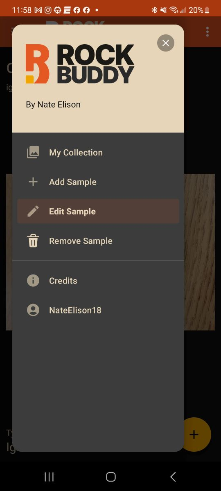
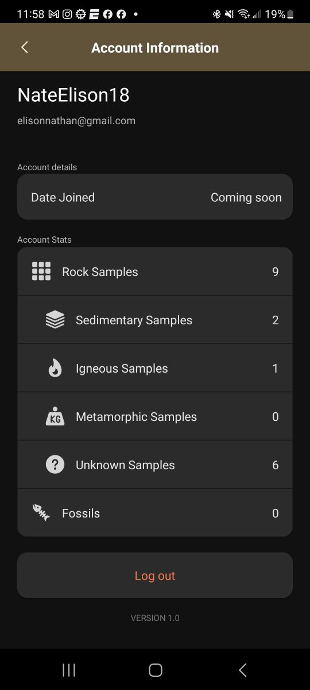

# RockBuddy_Mobile

## Synopsis
Welcome to Rock Buddy Mobile! This program is a rock collection companion app for android. It provides a way for rock collectors to digitize their collection. Users are able to add samples, edit samples, remove samples, and view their collection. Samples include the rock name, rock id, composition, structures, and more. Users are able to add multiple pictures per Sample if they wish.
User information, samples, and images are stored in a mySQL database, that I am hosting on a Heroku server. I wrote an API in php to perform CRUD opperations between the Android app and the database. 
This is a work in progress and once completed will act as my Stech Capstone project.

## Motivation
After developing Rock Buddy for desktop, I wanted to create a mobile edition to be more accessable.

## How to Run
It is recommended the device be in dark mode. Users will need to install the APK on their Android device. Once installed, they will need to follow the instructions to grant the app permission to access files. Thats it! 

## Screenshots

  
  
  

## Coming Soon
I'm working on getting a collection filter up and running and building out the frontend to be able to tie multiple images to a single sample.
My final goal is to see Rock Buddy up on the Google Play store. Please keep an eye out!

## Contributors
  UI/UX and logo design by Jordan Ireland: jaireland34@gmail.com  
  I wrote all the code.  
  For feature ideas please reach out! I can be contacted via email: elisonnathan@gmail.com.   
  Thank you!

